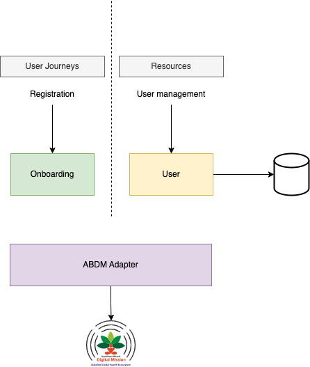

# Architecture Overview

This section presents a brief overview of our architecture and design choices.

The application consists of a frontend and a backend, along with a database. The backend of our application interacts with the ABDM components (like the Gateway, the Consent Manager and the like) through API calls on exposed endpoints.

## Technologies/Design Choices

For the frontend, we have decided to go with the following tech stack:
- Next.js/React
- Tailwind CSS

For the backend, we have decided to go forward with the following tech stack:
- Express, running on NodeJS

We use a relational database (PostgreSQL) for storing relevant information.

The frontend and the backend are connected with a RESTful API.
The backend of our application further interacts with the APIs of ABDM to provide relevant functionalities.

## Service architecture
We have three services in our application:
- The **Onboarding Service** is responsible for handling registration of users (patients)
- The **User Service** is responsible for handling user management.
- The **ABDM Adapter** is responsible for handling interactions with ABDM components mainly dealing with gateway validation and request validation (ABDM request validation has misleading messages).

