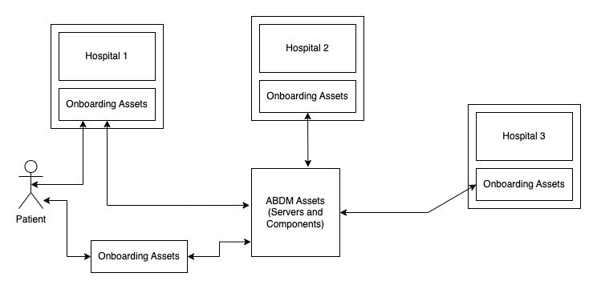

# Unified Health Ecosystem
We aim to create open-source digital assets to enable hospitals and healthcare facilities to become a part of the ABDM(_Ayushman Bharat Digital Mission_) network.

## Roadmap

We are following the roadmap set by NHA for application development on the ABHA platform. The implementation is divided into 3 milestones: M1, M2 and M3. The assets are currently in the process of being developed for M1.

The recommended steps and requirements are detailed below (as taken from the [NDHM Sandbox documentation](https://sandbox.abdm.gov.in/docs/integration_and_exit_process)):

### Milestone 1 (M1): Technical Features

- [ ] Registration
  - [ ] via Aadhaar
  - [ ] via mobile number
  - [ ] via DL
- [ ] Login
  - [ ] via Aadhaar
  - [ ] via mobile number
  - [ ] via password
- [ ] Forgot ABHA number
  - [ ] retrieve via Aadhaar
  - [ ] retrieve via mobile number
  - [ ] retrieve via password
- [ ] Profile
- [ ] Edit profile
  - [ ] Update password
    - [ ] via Aadhaar
    - [ ] via mobile number
    - [ ] via password
  - [ ] Update mobile
    - [ ] via Aadhaar
    - [ ] via mobile number
    - [ ] via password
  - [ ] Update email
    - [ ] via Aadhaar
    - [ ] via mobile number
    - [ ] via password
- [ ] Delete ABHA number
  - [ ] via Aadhaar
  - [ ] via mobile number
  - [ ] via password

## Where Our Assets Fit In

Our assets provide an easy to use layer above the ABDM infrastructure with the primary purpose of increasing the number of patients and healthcare facilities registered with the ABDM.

